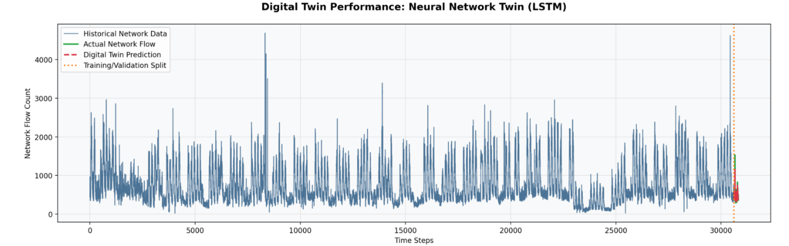

## Project Structure

```
├── Data/                   # Data directory containing datasets
├── README.md              # This file
├── data_loader.py         # Data loading utilities
├── main.py               # Main execution file
├── model_architectures.py # Model definitions and architectures
├── training_utils.py      # Training helper functions
└── visualization_utils.py # Visualization and plotting utilities
```

### Installation

1. Clone the repository or dowloading the zip file for it
```bash
git clone https://github.com/johnsengendo/NewProject
```

2. Installing required dependencies:

pip install Streamlit

### Usage

Running the main script:
```bash
 streamlit run main.py
```

**Important:** Ensuring all files and the `Data/` folder are in the same directory as `main.py` for the project to work correctly.

## File Descriptions

- **main.py** - The main entry point of the application
- **data_loader.py** - Handles data loading and preprocessing
- **model_architectures.py** - Contains model definitions and neural network architectures
- **training_utils.py** - Utility functions for model training
- **visualization_utils.py** - Functions for creating plots and visualizations
- **Data/** - Directory containing all dataset files 543.csv for training and the rest for inferece

## Results
  


## Improved DT interface
 

## Effect of varying training and prediction intervals
 
 
 
